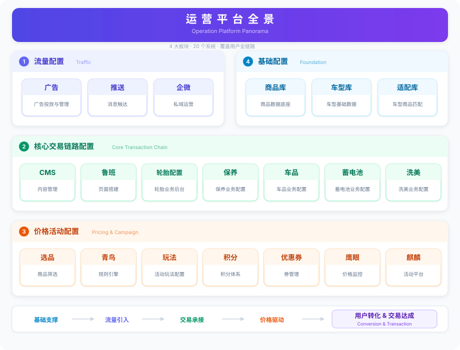

# 运营平台全景

> 4P 理论 · 20 个系统 · 覆盖用户全链路



---

## 4P 框架映射

| 4P | 平台板块 | 解决的问题 |
|----|---------|-----------|
| **Place（渠道）** | 流量配置 | 解决流量问题 — 把用户引进来 |
| **Product（产品）** | 核心交易链路配置 | 解决承接问题 — 让用户能买到东西 |
| **Price（价格）+ Promotion（促销）** | 价格活动配置 | 解决推一把的问题 — 让用户愿意买 |
| *基础支撑* | 基础配置 | 底层数据底座，支撑上面三层运转 |

```
基础支撑 → 渠道引流(Place) → 产品承接(Product) → 价格促销推一把(Price+Promotion) → 成交
```

---

## 1. Place 渠道 — 流量配置 | Traffic

负责把用户引进来，覆盖公域投放到私域触达的全渠道流量获取。

| 系统 | 定位 |
|------|------|
| 广告 | 广告投放与管理 |
| 推送 | 消息触达 |
| 企微 | 私域运营 |

---

## 2. Product 产品 — 核心交易链路配置 | Core Transaction

承接用户从入口浏览到下单的完整交易链路，按业务线垂直配置。

| 系统 | 定位 |
|------|------|
| CMS | 内容管理 |
| 鲁班 | 页面搭建 |
| 轮胎配置后台 | 轮胎业务后台 |
| 保养 | 保养业务配置 |
| 车品 | 车品业务配置 |
| 蓄电池 | 蓄电池业务配置 |
| 洗美 | 洗美业务配置 |

---

## 3. Price + Promotion 价格促销 — 价格活动配置 | Pricing & Campaign

驱动用户转化的核心杠杆，涵盖选品、定价、促销、玩法全链路。价格和促销合在一起，就是"推一把"让用户下单的力量。

| 系统 | 定位 |
|------|------|
| 选品 | 商品筛选 |
| 青鸟 | 规则引擎 |
| 玩法 | 活动玩法配置 |
| 积分 | 积分体系 |
| 优惠券 | 券管理 |
| 鹰眼 | 价格监控 |
| 麒麟 | 活动平台 |

---

## 4. 基础配置 | Foundation（支撑 4P 运转的数据底座）

底层数据支撑，为上层业务提供标准化的商品与车型数据。

| 系统 | 定位 |
|------|------|
| 商品库 | 商品数据底座 |
| 车型库 | 车型基础数据 |
| 适配库 | 车型商品匹配 |
